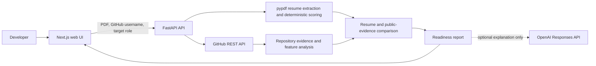

# Repolume

[](https://github.com/CadeSchiano/ai-resume-github-analyzer/actions/workflows/ci.yml)

Repolume is a full-stack web app that compares a developer's PDF resume with evidence from their public GitHub repositories and returns a deterministic readiness report with practical next steps.

## Live demo

Try the app at [ai-resume-github-analyzer.vercel.app](https://ai-resume-github-analyzer.vercel.app/).

## Overview

Developer resumes often list tools without showing where those tools were used. Repolume makes that gap easier to inspect: it parses a resume, reviews original public repositories through the GitHub REST API, and maps resume skills to visible project evidence.

Scores are generated by fixed, inspectable rules. The optional AI feature explains a completed report but does not create or change scores.

## Features

- Parses selectable-text PDF resumes in memory, including layout-aware extraction for common resume formats.
- Recognizes supported technical skills, resume sections, experience entries, project entries, action-oriented language, and selected outcome signals.
- Reviews up to eight recently updated, original public repositories for visible source code, documentation, tests, CI, project complexity, presentation, technology breadth, and activity.
- Separates missing GitHub data from missing evidence so unavailable API responses are not silently converted to low scores.
- Maps supported resume skills to detected technologies in public repositories.
- Calculates role-readiness context for seven early-career paths: software engineering intern, software engineer, backend, frontend, full-stack, mobile, and AI/ML.
- Offers an opt-in OpenAI explanation of the deterministic report, with server-side rate limiting and no raw PDF sent to OpenAI.

## Architecture



The application is intentionally stateless. It has no accounts, database, background workers, private-repository access, or persistent resume storage.

## How it works

1. The browser sends a GitHub username, a PDF resume, and an optional target role to the API.
2. The API validates the upload, extracts selectable text, and creates a deterministic resume report.
3. It retrieves public GitHub repository metadata and evidence, then evaluates repository-level signals without cloning repositories.
4. Repolume combines the reports, maps recognized resume skills to public project evidence, and returns the result to the web UI.
5. If selected by the user, the API sends the completed report, not the raw PDF, to OpenAI for a short explanation.

## Screenshots

No sanitized product screenshots are committed yet. See [docs/screenshots](docs/screenshots/README.md) for the two recommended captures and redaction guidance.

## Tech stack

| Area | Technology |
| --- | --- |
| Frontend | Next.js 16, React 19, TypeScript, Vercel Web Analytics |
| Backend | Python, FastAPI, Uvicorn |
| Resume processing | pypdf |
| Public repository evidence | GitHub REST API via `requests` |
| Optional explanation | OpenAI Responses API |
| Deployment | Vercel frontend and Render backend |
| Testing | pytest and FastAPI TestClient |

## Local development

### Prerequisites

- Python 3.12+
- Node.js 22+
- npm

### 1. Configure and start the backend

```bash
cd backend
python3 -m venv .venv
source .venv/bin/activate
python -m pip install --upgrade pip
python -m pip install -r requirements.txt
cp .env.example .env
uvicorn app.main:app --reload
```

The API starts at `http://127.0.0.1:8000` and exposes `GET /health`.

### 2. Configure and start the frontend

In a second terminal:

```bash
cd frontend
npm install
cp .env.example .env.local
npm run dev
```

Open `http://localhost:3000`.

## Environment variables

### Backend

| Variable | Required | Purpose |
| --- | --- | --- |
| `GITHUB_TOKEN` | No | Raises the server's GitHub API rate limit for public-repository analysis. |
| `OPENAI_API_KEY` | Only for AI explanations | Authorizes optional OpenAI explanations. Keep server-side only. |
| `OPENAI_MODEL` | No | Overrides the default `gpt-5-mini` explanation model. |
| `FRONTEND_ORIGINS` | No locally, yes in deployment | Comma-separated origins allowed by CORS. |

### Frontend

| Variable | Required | Purpose |
| --- | --- | --- |
| `NEXT_PUBLIC_API_URL` | No locally, yes in deployment | Browser-visible URL for the FastAPI backend. This is not a secret. |

Use the provided `.env.example` files as templates. Never commit real tokens or keys.

## Testing and validation

The backend test suite covers deterministic scoring, resume parsing, PDF validation and extraction behavior, GitHub evidence processing, API validation, CORS, rate limiting, and optional AI-response handling with mocked clients. It does not call GitHub or OpenAI in ordinary tests.

```bash
cd backend
python -m pytest

cd ../frontend
npm run build
```

The production frontend build also runs the configured TypeScript checks. There is currently no separate frontend unit-test suite.

## Project structure

```text
backend/
  app/
    routes/       FastAPI endpoints
    services/     resume, GitHub, scoring, and AI explanation logic
    security.py   request and AI explanation rate limiting
  tests/          deterministic API and service tests
frontend/
  app/            Next.js pages, role guides, and styles
.github/workflows/
  ci.yml          backend tests and frontend production build
docs/screenshots/ screenshot guidance for README assets
```

## Deployment

The frontend is deployed on Vercel and the API is deployed separately on Render. The frontend uses `NEXT_PUBLIC_API_URL` to call the API; the backend uses `FRONTEND_ORIGINS` to restrict browser origins. API credentials belong only in the Render service's environment variables, never in Vercel or the repository.

## Limitations and responsible use

Repolume evaluates only the evidence it can parse from a submitted resume and the selected public repositories. A score is informational, not an objective measure of employability, engineering ability, or interview performance. It should not be used as an automated hiring decision or a substitute for human review.

PDF layouts and public repository metadata vary, so results can be incomplete. Private repositories are never accessed, and missing public evidence does not mean a person lacks a skill.

## License

No license file is currently included in this repository.
